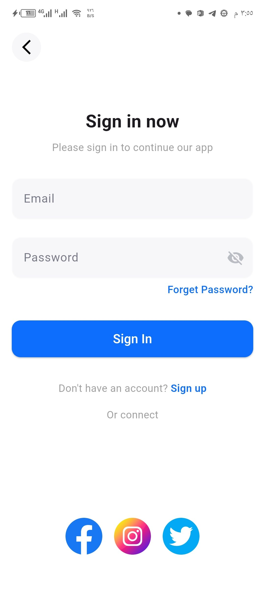
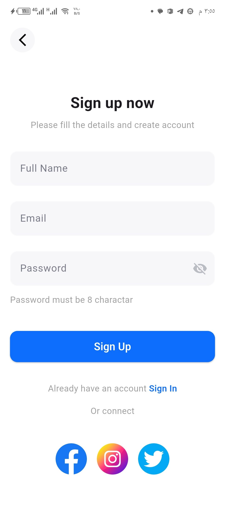
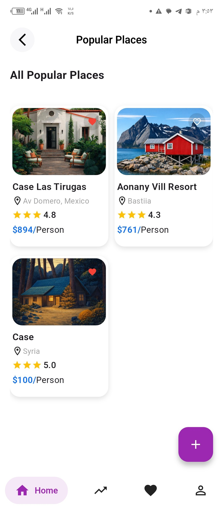
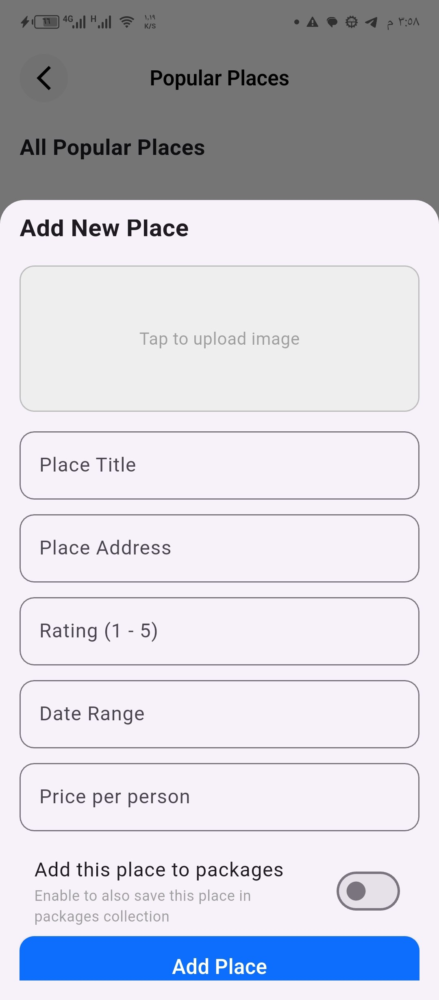
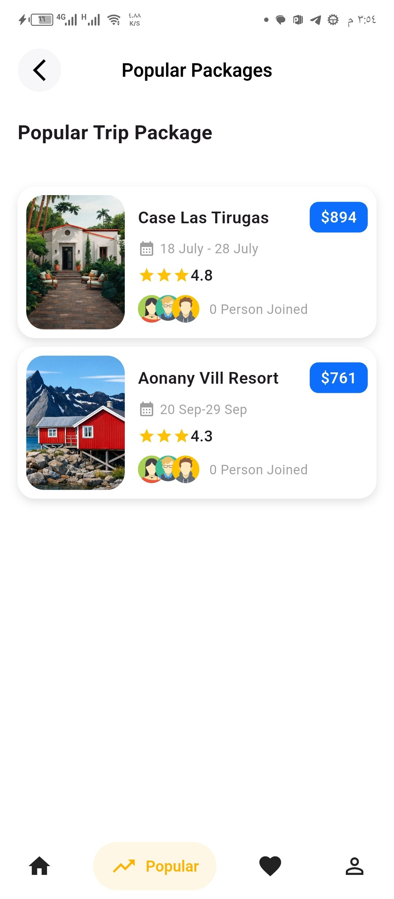
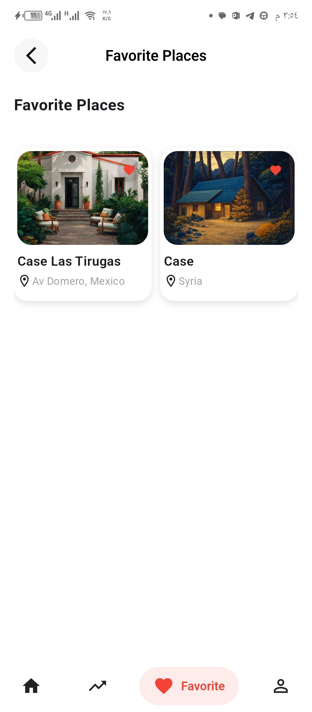
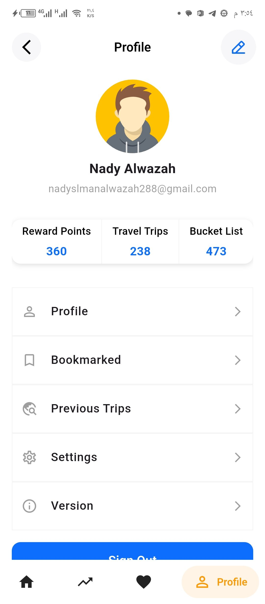
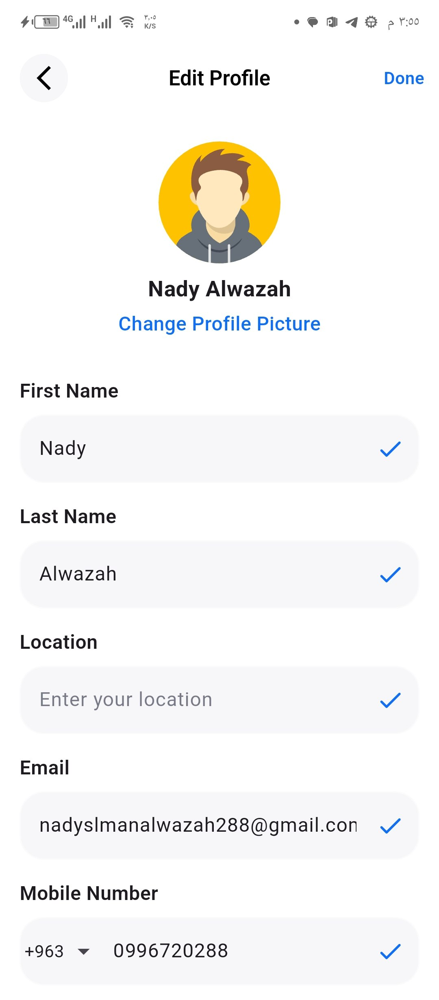

# 🌍 Travel App – Flutter + Firebase

A complete Travel App built with **Flutter**, connected to **Firebase Authentication** and **Cloud Firestore**, featuring real‑time updates, favorites system, profile editing, and responsive UI.

---

## 🎯 Objective

Build the core features of a Travel App connected to Firebase (Auth & Firestore).  
The app includes responsive UIs, real-time data fetching, and a fully connected user session across multiple screens.

---

## 🧩 Core Features

### 1️⃣ Splash Screen  
A simple splash screen shown before navigating to the authentication flow.

---

### 2️⃣ Authentication Flow

**Screens:**
- Sign In  
- Sign Up  

**UI Requirements:**
- Form validation (Email + Password)
- Password must be **at least 8 characters**
- Password visibility toggle
- Scrollable layout to avoid overflow when keyboard opens

**Firebase Integration:**
- Login & Register using **FirebaseAuth**
- On successful Sign Up → create a user document in `users` collection

---

### 3️⃣ App Navigation & Home Screen

**Features:**
- Persistent **Bottom Navigation Bar**
- Screens:
  - Home (All Popular Places)
  - Popular Packages
  - Favorite Places
  - Profile

**Floating Action Button (FAB):**
- Opens a dialog/sheet to add a new place  
- Each place card displays:
  - Image
  - Title
  - Location (pin icon)
  - Rating stars
  - Price per person
  - Heart toggle icon

---

### 4️⃣ Popular Packages & Favorite Places

**Popular Packages Screen:**
- Vertical list showing:
  - Price
  - Rating
  - Date

**Favorite Places Screen:**
- Two‑column grid layout
- Active heart icon

**Firebase Integration:**
- Fetch data from:
  - `places` collection  
  - `packages` collection  
- Using **streams** or **future fetching**

**Important:**  
Favorite Places must be **user‑specific**, filtered by the authenticated user’s UID.

---

### 5️⃣ Profile Management & Live Update

**Screens:**
- Profile  
- Edit Profile  

**Features:**
- Live streaming of user data  
- Edit profile updates Firestore instantly  
- Sign Out button:
  - Logs out user
  - Clears session
  - Redirects to Sign In screen

---

### 6️⃣ Dynamic Favorite Toggle

- Heart icon works across all screens  
- Adds/removes place from user’s favorites in real‑time  
- Uses Firestore collections:
  - `users/{userId}/favorites/{placeId}`


---
## 🛠️ Tech Stack

### 📦 Framework
- **Flutter**

### 🔥 Backend
- **Firebase Authentication**
- **Cloud Firestore**

### 🧠 State Management & Architecture
- **Cubit**
- **Singleton Services Architecture**

### 🧵 Async & Data Handling
- **FutureBuilder**
- **StreamBuilder**

### 🎨 UI & UX
- **Responsive UI**


---


## 📁 Project Structure

```text
lib
├── 📂 core
│   ├── 📁 app
│   ├── 📁 models
│   ├── 📁 services
│   ├── 🎨 theme
│   ├── 🧰 utils
│   └── 🧩 widgets
│
├── 📂 features
│   ├── 🔐 auth
│   ├── 📱 borrom_bar_layout
│   ├── 🏠 home
│   ├── ⭐ favorite
│   ├── 👤 profile
│   ├── 📦 popular_packages
│   └── 🚀 splash
│
├── 📄 firebase_options.dart
└── 📄 main.dart
```

## 📸 Screenshots 


| Splash | Sign In | Sign Up | Home | Sheet | Packages | Favorites | Profile | Edit Profile |
| --- | --- | --- | --- | --- | --- | --- | --- | --- |
|  |  |  |  |  |  |  |  |  |


---

## 📌 Notes

This project was built as part of a training task to implement a complete Travel App with Firebase integration, real-time updates, and clean architecture.

---

## 👨‍💻 Developer
**Nady Alwazah**  
Flutter Developer – Skills Academy Training Program  
